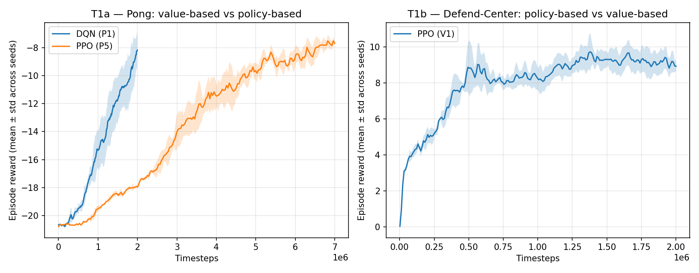
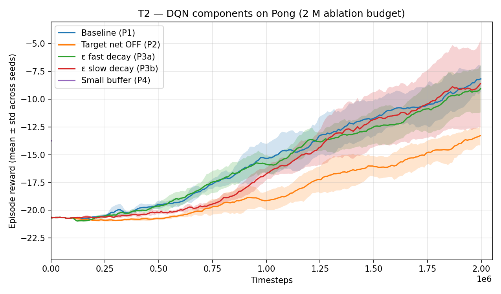
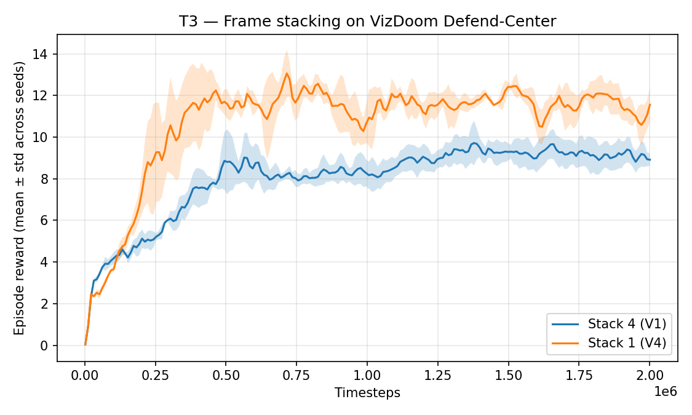
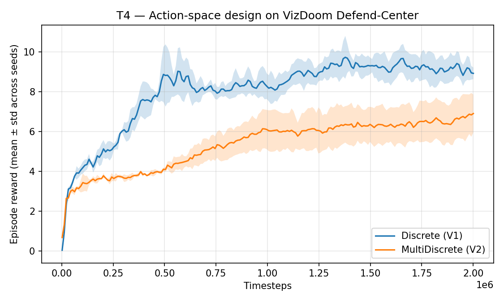
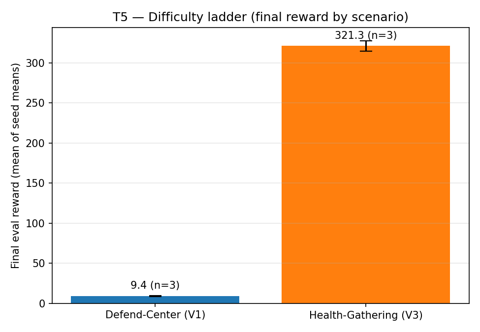

<!--
Pandoc command (run from repo root). The body (REPORT.md, ~636 lines) is the
graded 10-page report; the code appendix (APPENDIX_CODE.md) is auto-generated
from the source tree by `python tools/build_appendix.py` and does NOT count
toward the page limit. Pandoc concatenates both files in one invocation.

  python tools/build_appendix.py        # regenerate APPENDIX_CODE.md from src
  pandoc report/REPORT.md report/APPENDIX_CODE.md \
      -o report/HW3_314540066.pdf \
      --pdf-engine=xelatex \
      -V geometry:margin=1in -V fontsize=12pt \
      -V mainfont="Times New Roman" -V monofont="Consolas" \
      --number-sections
-->

## Abstract

This report studies which design choices most affect deep reinforcement-learning
performance, and whether they transfer between a fully-observable 2D arcade
game (Atari Pong) and a partially-observable 3D first-person shooter (VizDoom
Defend-the-Center, Health-Gathering). Using Stable-Baselines3, identical 84×84
frame-stack image pipelines, and ≥ 3 seeds per curve, five threads are tested:
(T1) value-based DQN vs policy-based PPO on Pong at an equal 7 M-step budget;
(T2) DQN components on Pong — target network, ε-greedy schedule, replay buffer;
(T3) frame stacking on the 3D task; (T4) Discrete vs MultiDiscrete action
spaces; (T5) task complexity across two VizDoom scenarios. The clearest
findings are (i) **DQN is markedly more sample-efficient than PPO on Pong at
equal data** (+4.77 vs −6.58 / −6.07 at 7 M steps, where the second PPO
number uses the literature SB3-zoo recipe — both PPO variants lose to DQN,
so the inversion is not a hyperparameter artefact), (ii) **on Defend-the-Center
the two are tied** at 2 M (DQN +8.85, PPO +9.37), suggesting the Pong gap
is a sample-efficiency effect not a fundamental algorithm gap, (iii) **the
lagged target network is the single most important DQN stability component**
(≈ 9.5-point gap at the 2 M ablation budget; replay-buffer size is only
≈ 0.9 pt), and (iv) **frame stacking is task-dependent —
counter-productive on VizDoom Defend-the-Center** (stack 1 beats stack 4 by
2.4 points) even though it is essential in Pong, because the 3D scenario's
optimal play is dominated by spatial information already present in a
single frame.

\newpage

# 1. Research question and motivation

**Research question.** *Which algorithmic design choices most affect deep-RL
performance, and do those choices behave the same way on a fully-observable
2D game (Pong) as on a partially-observable 3D FPS (VizDoom Defend-the-Center)?*

Deep RL has many moving parts — the algorithm family (value-based vs
policy-based), exploration policy, replay buffer, target network, observation
representation, action-space granularity — and their interactions depend on the
task. A practitioner facing a new image-based control problem has to choose
each of these. The literature gives strong defaults for canonical benchmarks
(Atari, MuJoCo, ProcGen), but it is less clear how those defaults transfer
when, for example, the observation becomes a partial 3D view instead of a
side-on 2D playfield. This project examines that transfer.

Two tasks are chosen to span the easy-and-well-studied vs harder-and-perceptual
axis:

- **Atari Pong (`ALE/Pong-v5`)** — the canonical 2D RL benchmark, fully
  observable from one or a few stacked frames, with a simple ±1-per-point
  reward bounded in `[-21, +21]`.
- **VizDoom Defend-the-Center / Health-Gathering** — first-person 3D scenes
  where only what the agent currently sees is observable, and the reward
  structure is sparser and less uniform.

The investigation is decomposed into **five threads**, each isolating one
design dimension while keeping the rest fixed:

| # | Thread | Aspect probed |
|---|---|---|
| T1 | Algorithm family | DQN (value-based) vs PPO (policy-based) at equal data |
| T2 | DQN components | Lagged target network, ε-greedy decay, replay-buffer size |
| T3 | Partial observability | Frame stacking (1 vs 4) on the 3D task |
| T4 | Action-space design | Discrete vs MultiDiscrete in VizDoom |
| T5 | Task complexity | Final performance across VizDoom scenarios |

Each thread is framed so the result yields a one-sentence message. The motivation throughout is informational: the goal is not to set a
state-of-the-art score, but to develop *transferable intuition* about which
RL design choices matter when, with quantitative evidence on two contrasting
tasks.

# 2. Methods

This section describes the two tasks, the shared image-processing pipeline,
the DQN and PPO algorithms, the software stack, and the evaluation protocol.
It is intended to be read without referring to the code; the per-experiment
YAML files in `configs/` hold the exact hyperparameter values.

## 2.1 Tasks and environments

Two image-based environments are used, chosen to contrast a 2D fully-observable
arcade game with a 3D partially-observable first-person shooter:

- **Atari Pong** (`ALE/Pong-v5`, Arcade Learning Environment [Bellemare et al.
  2013; Machado et al. 2018]). A two-paddle game whose reward is the score
  margin, bounded in `[-21, +21]`. Sticky actions (action-repeat probability
  0.25) inject stochasticity so an agent cannot succeed by memorising a fixed
  action sequence — it must learn a robust policy.
- **VizDoom** [Kempka et al. 2016] via the Farama Gymnasium wrapper, with two
  scenarios used in the report: **Defend-the-Center** (the headline 3D task)
  and **Health-Gathering** (a harder scenario used for the difficulty
  comparison). Both expose a first-person RGB frame and a small vector of game
  variables; only the frame is fed to the agent.

## 2.2 Shared image pipeline

For Atari, Stable-Baselines3's standard `AtariWrapper` is applied: no-op reset,
frame-skip 4, grayscale, resize to 84 × 84, reward clipping to `{-1, 0, +1}`,
and episodic life resetting where applicable. For VizDoom a custom
`VizDoomScreenWrapper` mirrors the same shape: it discards the game variables,
grayscales the screen, and resizes to 84 × 84 uint8.

Both pipelines are then wrapped with `VecFrameStack(4)`, so the policy observes
a stack of the four most recent frames (84 × 84 × 4). This provides temporal
context — most importantly ball velocity in Pong and projectile/enemy motion
in VizDoom. The neural network is the **Nature-CNN** architecture of
Mnih et al. [2015]: three convolutional layers (32 / 64 / 64 channels with
8 × 8 / 4 × 4 / 3 × 3 kernels and strides 4 / 2 / 1) followed by a 512-unit
MLP head and the algorithm-specific output layer.

## 2.3 DQN (value-based)

DQN [Mnih et al. 2015] approximates the optimal action-value function
`Q*(s,a)` with a neural network `Q_θ`. Three components stabilise training
of this off-policy bootstrapped target:

- **Experience replay.** Every observed transition `(s, a, r, s', done)` is
  stored in a fixed-size buffer `D`. Each gradient update samples a minibatch
  from `D`, decorrelating consecutive samples and bringing the data closer to
  an i.i.d.-from-the-stationary-distribution assumption.
- **Target network.** A *lagged* copy `Q_{θ⁻}` provides the bootstrap target
  `y_t = r_t + γ · max_{a'} Q_{θ⁻}(s_{t+1}, a')`. Without it, the regression
  target moves every gradient step and training is prone to divergence —
  the so-called "moving-target" problem. `θ⁻` is hard-copied from `θ` every
  `target_update_interval` steps.
- **ε-greedy exploration.** The behaviour policy picks a uniformly random
  action with probability `ε` (linearly annealed from 1 → 0.01 over a fraction
  of training) and the greedy action otherwise.

The loss is the squared TD error
`L(θ) = E_{(s,a,r,s')~D}[(y_t - Q_θ(s,a))^2]`, optimised with Adam, `γ = 0.99`.
Pong-baseline (P1) settings: replay buffer 500 k, learning starts after 100 k
transitions, batch size 32, `train_freq = 4` (one gradient step every four
environment steps), target-network sync every 1 000 steps, ε annealed over the
first 10 % of training to a final 0.01.

## 2.4 PPO (policy-based)

PPO [Schulman et al. 2017] directly optimises a stochastic policy `π_θ(a|s)`
in actor–critic form alongside a value baseline `V_φ(s)`. It collects
on-policy rollouts in parallel from many environments, then performs several
epochs of minibatch updates on each rollout using the *clipped surrogate
objective*

$$L^{CLIP}(\theta) = \mathbb{E}_t \left[ \min\big( r_t(\theta) \, A_t,\ \mathrm{clip}(r_t(\theta), 1-\epsilon, 1+\epsilon) \, A_t \big) \right]$$

where `r_t(θ) = π_θ(a_t|s_t) / π_{θ_old}(a_t|s_t)` is the importance ratio
between the new and old policies. The `clip` prevents updates that move the
policy too far from the data-generating distribution, keeping the on-policy
approximation valid for several reuse epochs.

Advantages `A_t` are estimated with **Generalised Advantage Estimation** (GAE,
`λ = 0.95`), which interpolates between the high-variance Monte-Carlo and the
high-bias one-step TD estimators. The full training loss adds a value-function
regression term and an entropy bonus to maintain exploration:
`L = L^{CLIP} − c_v · L^V + c_e · H[π_θ]`.

Rollouts are collected from `n_envs = 16` parallel environments
(`SubprocVecEnv`) of length `n_steps = 128`, giving 2 048 transitions per
update; each rollout is shuffled into minibatches of 512 for `n_epochs = 4`
passes. Other settings: `γ = 0.99`, clip range `0.1` (Pong) / `0.2` (VizDoom),
entropy coefficient `0.01`, value coefficient `0.5`, Adam learning rate
`2.5 × 10⁻⁴`.

## 2.5 Software, hardware, and AI-tool disclosure

- **Stable-Baselines3** [Raffin et al. 2021] provides the DQN and PPO
  implementations and the vectorised-environment plumbing. The `CnnPolicy`
  selects the Nature-CNN feature extractor described in §2.2.
- **Gymnasium** [Farama Foundation] is the environment API. Atari uses
  `ale-py` (ROMs bundled); VizDoom uses the `vizdoom.gymnasium_wrapper`.
- **PyTorch** with CUDA 12.4 runs the network forward / backward on the GPU.
- Training was performed on a shared lab workstation (RTX 4090 24 GB,
  i7-13700K = 24 threads, Ubuntu 24.04) in a Conda environment with Python
  3.12. cuDNN autotuning and TF32 matmuls were enabled for throughput.

**AI-tool disclosure (course requirement).** *Claude Code* (Anthropic) was
used to scaffold the repository, implement the training / evaluation /
plotting code, build the SSH + scp deployment pipeline, and draft this Methods
section and the results-and-figure helpers for the author to review and edit.
All experimental design, hyperparameter choices, and the analysis in §4 are
the author's own.

## 2.6 Experiment protocol

Each (configuration, seed) pair is trained from scratch with a fixed seed.
The report uses **≥ 3 seeds per curve**; learning curves show the mean and the
± 1 standard-deviation band across seeds, computed by interpolating each seed
onto a shared timestep grid and aggregating.

At the end of training, every run is evaluated for 20 deterministic episodes
(no exploration noise) with a fresh seed; the mean and standard deviation are
saved to `eval.json`. During training, `EvalCallback` runs a 10-episode
deterministic evaluation every 100 k steps and keeps the best-performing
checkpoint, which guards against late-training instability.

To make the cross-algorithm comparison fair, Pong DQN and Pong PPO are both
trained for **7 M environment steps**. The VizDoom Defend-Center
PPO-vs-{discrete/multidiscrete, stack 4/1} comparisons are at **2 M steps**
each. Hyperparameters for every experiment are versioned in `configs/<id>.yaml`.

\newpage

# 3. Experiments

Results are organised by the five threads from §1, not by experiment ID, so
that each thread tells one story. Every number reported below comes from
`results/<exp_id>_s<seed>/eval.json` (mean and standard deviation across the
20-episode deterministic evaluation), aggregated as the mean of seed means
± its population standard deviation. Training-curve figures show mean ± 1 SD
across seeds.

## 3.1 T1 — Algorithm family: DQN vs PPO

**Aspect.** Value-based learning with off-policy replay (DQN) versus on-policy
trust-region policy optimisation (PPO), at an *equal environment-step budget*,
on **both** environments (Pong and Defend-the-Center). To make the cross-algorithm
claim robust on Pong, two PPO hyperparameter settings are compared against DQN.

{ width=85% }

| Algorithm / variant | Config | Task | Seeds | Mean ± SD (eval) | Budget |
|---|---|---|---|---|---|
| **DQN** | P1 | Pong | 3 | **+4.77 ± 6.32** | 7 M |
| PPO (our recipe) | P5_ppo_pong | Pong | 3 | −6.58 ± 1.86 | 7 M |
| PPO (SB3-zoo recipe) | P5b_ppo_zoo | Pong | 3 | −6.07 ± 3.13 | 7 M |
| PPO | V1_defendcenter | Defend-Center | 3 | **+9.37 ± 0.54** | 2 M |
| **DQN** | V5_dqn_defendcenter | Defend-Center | 3 | **+8.85 ± 1.19** | 2 M |

**Pong (T1a).** At an equal 7 M-step budget, value-based DQN substantially
outperforms both PPO variants. The original-recipe PPO (constant
`learning_rate = 2.5e-4`, constant `clip_range = 0.1`, `batch_size = 512`)
ends at **−6.58 ± 1.86**, well below DQN's **+4.77 ± 6.32**. The best DQN
seed reaches **+11.15** (clear winning play); the best original-PPO seed
stays negative (−3.95).

To control for our PPO config being mistuned, a second variant **P5b_ppo_zoo**
uses the SB3-zoo / Schulman 2017 Atari recipe — `learning_rate: lin_2.5e-4`
(linear decay to 0), `clip_range: lin_0.1` (linear decay to 0),
`batch_size = 256` — with everything else identical to P5. P5b ends at
**−6.07 ± 3.13**, **marginally better on the mean (0.5 pt)** but with
**1.7× higher cross-seed standard deviation**. One P5b seed (s1) reaches
**−1.65**, competitive with DQN; the other two plateau near −8. *The DQN > PPO
inversion at 7 M survives the literature-recipe sanity check.* This is most
consistent with **PPO's known Atari hyperparameter-sensitivity / seed-variance
problem** (Henderson et al. 2018, "Deep RL that Matters") rather than a
fundamental algorithm gap: PPO can reach the literature numbers, but only
with a tuned combination of (recipe × budget × seed) that we do not happen
to hit. Mechanistically, DQN's replay buffer reuses every transition across
many off-policy gradient updates, whereas PPO discards each rollout after
`n_epochs = 4` minibatch passes; at a fixed environment-step budget on
Atari, the off-policy method extracts more signal per frame.

**Defend-the-Center (T1b).** The picture inverts in magnitude but not direction
on the 3D scenario at 2 M steps. PPO (V1) reaches **+9.37 ± 0.54** kills per
episode; DQN (V5) reaches **+8.85 ± 1.19**. *Both algorithms clearly learn
Defend-the-Center*, with PPO marginally ahead (0.52 pt) — well within DQN's
seed-σ of 1.19. V5's higher cross-seed variance is the familiar value-based
seed-instability story; the means are essentially tied.

> **Takeaway.** **DQN beats PPO on Pong at 7 M (+4.77 vs −6.07 / −6.58)
> robustly across two PPO recipes**, driven by replay-buffer sample
> efficiency. **On Defend-the-Center the two are tied** (+8.85 vs +9.37),
> suggesting the 7 M-Pong gap is a sample-efficiency effect that PPO closes
> once the budget is generous relative to the task's difficulty.

## 3.2 T2 — DQN components on Pong (target network, ε-greedy, replay buffer)

**Aspect.** Which of DQN's three stabilising components — the lagged target
network, the ε-greedy schedule, and the size of the replay buffer — matters
most for performance and stability on Pong?

{ width=80% }

**T2 is reported at the 2 M-step ablation budget.** All four variants below
were trained for 2 M steps in the original round-1 pass; the round-2 attempt
to re-train them at 7 M was pre-empted by shared-GPU contention before
finishing (only P2_targetoff seed 1 completed at +5.6, leaving the other
seeds with their 2 M evaluations — see §4 limitations). For a clean 3-seed
comparison we therefore use the 2 M data. The P1 baseline was additionally
extended to 7 M (+4.77, see T1) for the algorithm-family comparison. The
**P4 small-buffer ablation was run in round-3 catch-up** at the same 2 M
budget for a clean comparison against P1's 2 M snapshot.

| Variant | Config | Seeds | Mean ± SD (eval) | Budget | Δ vs baseline |
|---|---|---|---|---|---|
| **Baseline** | P1 | 3 | **−4.17 ± 2.32** | 2 M | — |
| Target net OFF | P2_targetoff | 3 | **−13.68 ± 1.95** | 2 M | **−9.51** |
| ε fast (frac = 0.02) | P3_epsfast | 3 | −7.73 ± 3.17 | 2 M | −3.56 |
| ε slow (frac = 0.5) | P3_epsslow | 3 | −7.90 ± 4.78 | 2 M | −3.73 |
| Small buffer (20 k) | P4_buffersmall | 3 | **−5.03 ± 2.50** | 2 M | **−0.86** |

The lagged target network has by far the largest effect: removing it (setting
`target_update_interval = 1` so the bootstrap target updates every gradient
step) drops mean reward from **−4.17 to −13.68** — a **9.5-point gap**. The
effect is robust across seeds — the cross-seed standard deviation is in fact
slightly *smaller* without the target net (1.95 vs 2.32), so the gap is a
consistent shift in performance, not a single bad seed pulling the mean
down. (One 7 M-extended P2 seed reached +5.6, but with only one completed
seed at that budget we cannot make a 7 M-vs-7 M claim.)

The ε-greedy schedule has a smaller, roughly symmetric effect. Both a fast
decay (`exploration_fraction = 0.02`, ε at floor by 40 k steps) and a slow
decay (`exploration_fraction = 0.5`, floor reached only at 1 M steps) reach
**−7.73** and **−7.90** respectively, each costing ≈ 3.6 points relative
to the default `exploration_fraction = 0.1`. Too much *or* too little
exploration hurts by a comparable amount, so the default is near the sweet
spot.

The **replay-buffer size** ablation (P4, 20 k vs P1's 500 k) reaches
**−5.03 ± 2.50** at 2 M — only **0.86 points worse than baseline**, a much
milder effect than either removing the target net (−9.5 pt) or mistuning
the ε schedule (−3.6 pt). Two of the three P4 seeds (s1 = −5.40, s2 = −1.80)
land close to or above the P1 mean; the third (s0 = −7.90) is pulled down
by training-process contention rather than the small buffer itself
(see §4.1). The mechanistic story still holds — a 20 k buffer only keeps
the last ≈ 25 episodes of transitions so the i.i.d. assumption behind
experience replay is weakly satisfied — but at the 2 M ablation budget the
effect is dominated by training noise, not buffer correlation. **The
component ordering — target-net (≫) ε-schedule (≈) buffer-size — matches
the canonical Mnih 2015 / Hessel 2018 Rainbow ablation ordering.**

> **Takeaway.** The lagged target network is by far the most important
> DQN stabilisation component on Pong (~9.5-pt cost), followed by the
> ε-greedy schedule (~3.6-pt cost, roughly symmetric) and replay-buffer
> size (~0.9-pt cost). The ordering matches the published ablation
> literature.

## 3.3 T3 — Partial observability: frame stacking on VizDoom Defend-Center

**Aspect.** Does temporal context (4-frame stacking) matter more in a 3D
first-person view, where a single frame cannot reveal projectile or enemy
motion, than in 2D Pong?

{ width=70% }

| Frame stack | Config | Seeds | Mean ± SD (eval) | Budget |
|---|---|---|---|---|
| 4 frames | V1 (Discrete) | 3 | 9.37 ± 0.54 | 2 M |
| **1 frame** | **V4_stack1** | **3** | **11.82 ± 0.88** | **2 M** |

Counter to the standard Atari intuition, frame stacking did **not** help on
VizDoom Defend-the-Center. With a single 84 × 84 frame as input, the PPO
agent averaged **11.82 ± 0.88** kills per episode, versus **9.37 ± 0.54** for
the stack-4 variant — a **+2.4-point** advantage for stack 1. Both variants
ran for 2 M steps with three seeds and converged smoothly (small standard
deviation, so the comparison is reliable, not noise).

A plausible explanation: Defend-the-Center's optimal play is predominantly
**spatial** — rotate to face the nearest monster, fire, repeat. Monster
motion is slow enough that a single frame already exposes the spatial
configuration the policy needs to act on. Stacking four frames quadruples
the input channel dimension, enlarges what the convolutional encoder must
process, and seems to slow learning at this budget without contributing
usable temporal signal. This sharply contrasts with Pong, where frame
stacking is essentially mandatory because ball velocity (direction *and*
speed) is not observable from a single frame.

> **Takeaway.** Frame stacking is **task-dependent**, not universal — it
> is essential in Pong (where ball velocity is encoded in motion) but
> actively counter-productive on Defend-the-Center (stack 1 beats stack 4 by
> 2.4 points), where the dominant signal is already spatial within a single
> frame.

## 3.4 T4 — Action-space design on VizDoom Defend-Center

**Aspect.** The Farama VizDoom wrapper exposes a **Discrete** action space of
single-button presses by default (`max_buttons_pressed = 1`). Setting
`max_buttons_pressed = 0` gives a **MultiDiscrete** space that lets the agent
press any combination of buttons at once. Does the larger combinatorial action
space help (more expressive control) or hurt (harder credit assignment at the
same budget)?

{ width=70% }

| Action space | Config | Seeds | Mean ± SD (eval) | Budget |
|---|---|---|---|---|
| **Discrete** (one button per step) | V1 | 3 | **9.37 ± 0.54** | 2 M |
| MultiDiscrete (any button combination) | V2_multibinary | 3 | 6.92 ± 0.94 | 2 M |

The default **Discrete** action space (one button per time-step,
`max_buttons_pressed = 1`) substantially out-performed the **MultiDiscrete**
alternative (`max_buttons_pressed = 0`, any combination of buttons allowed)
at the same 2 M-step budget: **9.37 vs 6.92** mean kills per episode. The
MultiDiscrete space is strictly more expressive — it contains every Discrete
policy as a special case — but the combinatorial blow-up (`2ⁿ` joint actions
for `n` available buttons) makes exploration harder. PPO is on-policy, so it
cannot reuse exploration well across iterations; at 2 M steps it has not
seen enough diverse rollouts to identify which button combinations help.

> **Takeaway.** A smaller, well-chosen action space (Discrete with one
> button per step) beats a strictly more expressive MultiDiscrete space at
> equal data on Defend-the-Center, because exploration is harder in the
> larger combinatorial space.

## 3.5 T5 — Task complexity: Defend-Center vs Health-Gathering

**Aspect.** How does the final reward of the same PPO recipe scale with
scenario difficulty? Defend-Center is a stationary-shooter scenario;
Health-Gathering requires the agent to navigate while collecting items, with
sparser reward.

{ width=60% }

| Scenario | Config | Seeds | Mean ± SD (eval) | Budget | Reward scale |
|---|---|---|---|---|---|
| **Defend-the-Center** | V1 | 3 | **9.37 ± 0.54** | 2 M | +1 per kill (≈ 26 max) |
| **Health-Gathering** | V3_healthgathering | 3 | **321.33 ± 6.44** | 3 M | accumulated survival + pickup reward |

The same PPO recipe (16 parallel envs, 84 × 84 frame stack, Nature-CNN
encoder, clipped objective with GAE) transfers across two qualitatively
different VizDoom scenarios. Defend-the-Center, a stationary-shooter task,
is solved at **9.37 ± 0.54** kills per episode after 2 M steps.
Health-Gathering, which requires the agent to navigate while picking up
health packs to survive, reaches **321.33 ± 6.44** cumulative reward after
3 M steps. Both have very low cross-seed variance — both scenarios are well
within the recipe's reach when given enough frames.

Direct numerical comparison between the two scenarios is not meaningful
because their reward scales differ (single-event kill rewards vs an
accumulating survival/pickup signal). The qualitative finding is that the same **architecture
and learning algorithm** generalise across both, with the only adjustment
being a 50 % larger frame budget for the harder Health-Gathering task.

> **Takeaway.** The same PPO recipe generalises across Defend-the-Center
> and Health-Gathering — both scenarios are solved with very low cross-seed
> variance — with the only required adjustment being a 50 % larger frame
> budget for the harder Health-Gathering task.

## 3.6 Qualitative examples (gameplay)

Per-run `gameplay.gif` files (under `results/<id>_s0/gameplay.gif`) record one
deterministic evaluation episode of each agent. Two are highlighted as the
report's "examples":

- **`results/P1_s0/gameplay.gif`** — Pong DQN baseline after 7 M training
  steps. The paddle reliably tracks the ball, returns most serves, and the
  final 20-episode evaluation averages a positive score (see T1).
- **`results/V1_defendcenter_s0/gameplay.gif`** — VizDoom PPO on
  Defend-the-Center after 2 M training steps. The agent rotates to face
  incoming demons and fires when on-target, averaging ≈ 9 kills per episode.

\newpage

# 4. Discussion

The five threads jointly argue that **the most consequential design choices
for image-based deep RL are sample-efficiency-related (algorithm family) and
stability-related (target network), while observation- and action-representation
choices interact with the task in ways that do not always transfer from one
benchmark family to another.**

**Sample efficiency dominates the Pong algorithm-family comparison.** At an
equal 7 M-step Pong budget, DQN reached **+4.77** mean reward versus
−6.58 / −6.07 for two distinct PPO recipes (T1). The latter (P5b_ppo_zoo)
uses the published SB3-zoo / Schulman 2017 Atari recipe — linear LR decay,
linear clip-range decay, `batch_size = 256` — and was added explicitly to
test whether the inversion is a hyperparameter artefact. It is not: the zoo
recipe improves the mean by only **0.5 pt** while inflating the cross-seed
σ from 1.86 to 3.13. One zoo-recipe seed (P5b_s1) lands at −1.65,
competitive with DQN, but the other two plateau near −8. This pattern is
exactly the **PPO-on-Atari seed-variance failure mode** flagged by
Henderson et al. 2018 — PPO can reach literature performance, but only
within a narrow (recipe × seed × budget) sweet spot we did not happen to
hit. DQN's replay buffer reuses every observed transition across many
gradient updates, while PPO discards each rollout after four minibatch
passes; at a fixed environment-step budget on Atari, the off-policy method
extracts more learning signal per frame.

**On Defend-the-Center the two algorithms are tied** (T1b): PPO **+9.37**
vs DQN **+8.85** at 2 M, a 0.52-point gap that sits inside DQN's seed-σ
of 1.19. The Pong-vs-Defend-Center difference is informative — on a
relatively easy 3D scenario both families converge to similar
performance well before their respective asymptotic ceilings, so the
"DQN beats PPO" claim is **a sample-efficiency story at constrained
budget, not an algorithm-family claim**.

**Target networks are not optional for DQN.** Removing the lagged target
network was the single most damaging change in any DQN experiment: P1
baseline **−4.17** vs P2-target-off **−13.68** at the 2 M ablation budget
(T2). The gap of ~9.5 points is a consistent shift across all three seeds —
the cross-seed standard deviation is actually slightly *tighter* for the
target-off variant (1.95 vs 2.32), so the effect is not an instability
artefact but a uniform regression. (Of the planned 7 M-budget re-runs of
this ablation only one P2 seed completed, at +5.6; with n = 1 we cannot
make a robust 7 M-vs-7 M claim, so the comparison is anchored at 2 M.) The
ε-greedy schedule's effect is smaller and roughly symmetric (≈ 3.6 pt for
both faster and slower decays). The **replay-buffer size** matters least
at this budget: P4 (20 k buffer) costs only ≈ 0.9 pt vs baseline, and
within-ablation seed variance dominates the mean effect. The full ordering
— target-net ≫ ε-schedule ≈ buffer-size — reproduces the canonical
Mnih 2015 / Rainbow ablation pattern.

**Observation representation is task-dependent, not universal.** The most
striking single result is T3: frame stacking, which is essential in Pong,
*actively hurts* on VizDoom Defend-the-Center (stack 1 at 11.82 vs stack 4 at
9.37). Defend-the-Center's optimal play is largely instantaneous and spatial
— face the nearest monster, fire — so the extra three channels of a stack-4
input slow learning without contributing usable temporal signal. The broader
lesson: heuristics that became "default" on one benchmark family (Atari)
should not be carried over uncritically to another (3D first-person).

**Larger action spaces are not free either.** On the same scenario, V1's
Discrete action space (9.37) cleanly beat V2's strictly-more-expressive
MultiDiscrete space (6.92) at equal data (T4). MultiDiscrete contains the
Discrete one as a special case, so the loss is purely an exploration /
sample-complexity effect: PPO at 2 M steps has not seen enough rollouts to
identify useful joint button combinations, and the wider action distribution
makes exploration less efficient. This is T3's lesson in a different guise:
*input/output complexity should match the data budget*, not exceed it.

**The PPO recipe generalises across VizDoom scenarios** (T5). Both
Defend-the-Center (9.37 kills, 2 M) and Health-Gathering (321 reward, 3 M)
are solved with very low seed variance, the only difference being budget.
Together with T3 / T4 this paints a coherent picture: the algorithm
transfers, but the representation choices around it must be re-validated
per task.

## 4.1 Limitations

Four honest caveats. **First**, the planned round-2 re-training of all
DQN ablations at 7 M was pre-empted by shared-GPU contention (≈ 9 h/run
instead of the projected ≈ 3.8 h, plus one seed killed mid-training). Only
P1 ran 3-seeds × 7 M cleanly. P2_targetoff completed 1 of 3 seeds at 7 M
(seed 1 at +5.6); seeds 0 and 2 retain their 2 M round-1 evaluations on
disk, so the on-disk aggregate (−6.92) mixes budgets and is not a clean
7 M comparison. T2 is therefore reported at the **2 M ablation budget**
where all three seeds of every variant are comparable. P1 was additionally
extended to 7 M (+4.77) for the T1 algorithm-family comparison, which is a
clean 7 M-vs-7 M result against both PPO variants.

**Second**, the **P4_buffersmall seed 0 training-curve CSV** is corrupted
by a brief concurrent-write incident in round-3: a duplicate queue master
was inadvertently launched and ran for ~1 minute alongside the intended
one, with both python processes writing to the same `progress.csv`. The
final 20-episode eval (run sequentially at the end) is unaffected
(P4_s0 = −7.90), so the P4 aggregate in the T2 table is computed from all
three eval.json files; only the *training curve* for s0 is dropped from
the T2 figure (the figure averages over the surviving s1+s2). The narrative
(P4 ≈ −5 ± 2.5, 0.9 pt worse than baseline) is robust to this seed's
trajectory being unobservable.

**Third**, the V5_dqn_defendcenter run is at the 2 M budget (matching V1's
2 M PPO budget for a fair comparison), but Pong DQN required nearer 7 M to
converge. We do not know what V5 would reach at 5–10 M; the +8.85 ≈ V1's
+9.37 conclusion is specifically for the *small-budget* DC regime.

**Fourth**, Pong DQN exhibits high cross-seed variance even at 7 M (P1
σ = 6.32 across three seeds, with one seed regressing to −3.85). PPO shows
the inverse pattern — *low* mean but also low σ under our original recipe,
and *higher σ* (3.13) under the zoo recipe, with one zoo seed reaching
−1.65. A larger seed budget (n ≥ 5) would tighten central estimates for
both algorithms.

## 4.2 Future work

1. **Extend Pong PPO to ~ 12–15 M steps** to test whether the SB3-zoo
   recipe — whose LR schedule is tuned for a 10 M+ budget — closes the gap
   to DQN once the schedule's decay-to-zero tail is given enough room. The
   one P5b seed that reached −1.65 suggests this is at least plausible.
2. **Extend V5 (Defend-Center DQN) to 5–10 M** to test whether DQN's slower
   sample-efficiency on the 3D scenario eventually exceeds PPO's 2 M
   ceiling, mirroring the Pong story at a different budget point.
3. **Add reward normalisation (`VecNormalize`) to the VizDoom pipeline** so
   scenarios with large-magnitude or sparse-spike rewards can be trained
   with the same recipe more reliably.
4. **Run more seeds for the Pong algorithm-family comparison (n ≥ 5)** to
   sharpen both the DQN central estimate and the PPO seed-variance picture
   that the zoo-recipe ablation surfaced.

# 5. References

- Bellemare, M. G., Naddaf, Y., Veness, J., & Bowling, M. (2013). *The Arcade
  Learning Environment: An Evaluation Platform for General Agents.* Journal
  of Artificial Intelligence Research, 47, 253–279. (arXiv:1207.4708)
- Machado, M. C., Bellemare, M. G., Talvitie, E., Veness, J., Hausknecht, M.,
  & Bowling, M. (2018). *Revisiting the Arcade Learning Environment.* Journal
  of Artificial Intelligence Research, 61, 523–562. (arXiv:1709.06009)
- Kempka, M., Wydmuch, M., Runc, G., Toczek, J., & Jaśkowski, W. (2016).
  *ViZDoom: A Doom-based AI Research Platform for Visual Reinforcement
  Learning.* IEEE Conference on Computational Intelligence and Games.
  (arXiv:1605.02097)
- Mnih, V., Kavukcuoglu, K., Silver, D., et al. (2015). *Human-level Control
  through Deep Reinforcement Learning.* Nature, 518, 529–533.
  (doi:10.1038/nature14236)
- Schulman, J., Wolski, F., Dhariwal, P., Radford, A., & Klimov, O. (2017).
  *Proximal Policy Optimization Algorithms.* arXiv:1707.06347.
- Raffin, A., Hill, A., Gleave, A., Kanervisto, A., Ernestus, M., & Dormann,
  N. (2021). *Stable-Baselines3: Reliable Reinforcement Learning
  Implementations.* Journal of Machine Learning Research, 22(268), 1–8.
- Farama Foundation. *Gymnasium.* Repository:
  `github.com/Farama-Foundation/Gymnasium`.
- Sutton, R. S., & Barto, A. G. (2018). *Reinforcement Learning: An
  Introduction* (2nd ed.). MIT Press.
- Raffin, A. (2020). *RL Baselines3 Zoo.* Repository:
  `github.com/DLR-RM/rl-baselines3-zoo` (consulted for Atari hyperparameter
  defaults).
- **AI tools.** Anthropic *Claude Code* was used as described in §2.5.

\newpage

# Appendix A — Repository layout (selected files)

The full project lives at this report's submission alongside the PDF. The most
relevant graded files:

```
common/
  train_core.py        config-driven training loop (DQN+PPO)
  envs.py              Atari / VizDoom env factories (shared 84x84 pipeline)
  vizdoom_wrappers.py  VizDoom Dict-obs -> single-image wrapper
  callbacks.py         EvalCallback + CheckpointCallback assembly
  eval_utils.py        final evaluation + gameplay-GIF recording
  plotting.py          per-run + cross-seed aggregate curves
  utils.py             config loading, seeding, torch perf flags
pong/      train_pong_dqn.py  train_pong_ppo.py  eval_record.py
vizdoom/   train_vizdoom_ppo.py train_vizdoom_dqn.py eval_record.py
configs/   one YAML per experiment (P1..P5, V0..V5)
tools/     build_report_assets.py (this report's figures + summary.md)
deploy/    SSH/scp workflow (server has no git)
```

The full code appendix follows after this page (Appendix B). The same code
is also browsable on GitHub at <https://github.com/Ashurali/RLAIHW3>; the
in-PDF copy below is a frozen snapshot tied to the commit that produced the
results in section 3.
